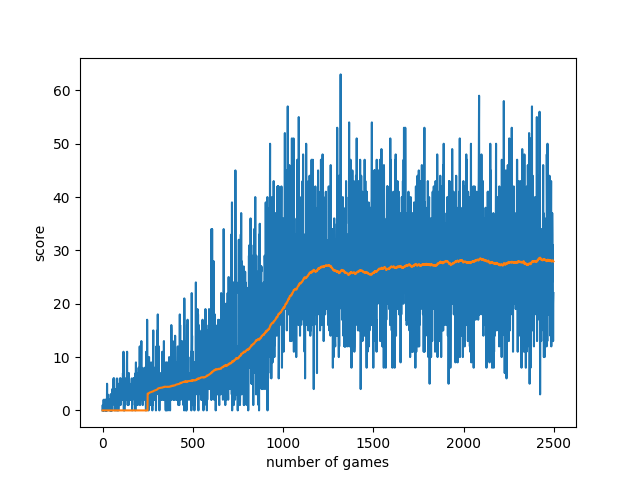

# Snake Q Learning
#### Video Demo: https://youtu.be/ajX2sHjmfGA
#### Description:

My final project was to make a Q learning algorithm that can play the classic game Snake. Using the base skills learned from CS50, I went on to do a course on machine learning and AI basics, which included creating a Q learning algorithm that was able to find the optimal route through a weighted graph. I enjoyed this project thoroughly, which led me to decide upon creating a similar algorithm that could play Snake, which I could then hand in as my final project for CS50 and look back on what I've learned since starting the course.

## snake.py
Creating the game itself was not part of the project, however I knew it would be much easier to have the ai interact with the game if the game was also written in Python. I therefore followed a Youtube tutorial to create the game, and learned a little about using PyGame in the process. Here is a link to the tutorial: https://youtu.be/QFvqStqPCRU?si=wByIkow25EoDyR8H

## train_ai.py

In order to create the agent itself, I defined the class Robot, and initialised it with some necessary attributes, including the alphe (learning rate), gamma (discount factor), epsilon (probability exploration/exploitation), as well as some attributes which would be used for storing and analysing data later. In addition the empty Q matrix and current state attributes were initialised.

### Interpereting state
The first decision I would have to make in order to create a Q learning algorithm was how to interperet the current state the agent was in. It was clear that the agent would have to have an understanding of which direction the snake was moving in, as well as which direction the food was in, but the main aspect I changed several times was how the snake could sense danger - where is the snake's body, and where are the walls, relative to the head of the snake? In the end I settled for checking whether there was a dangerous tile 1 block in each possible direction the snake could move in, as I found when attemting to detect danger in more tiles than that resulted in a combination of too many possible states, as well as some strange behaviour when the snake was 2 tiles from danger. The result was a Q matrix with 13 dimensions, 12 to represent the current state, and 1 to represent the 4 possible descisions for the next state (direction).

### Epsilon-greedy policy
As may have been inferred by the initialisation of the epsilon value, this Q learning algorithm uses an epsilon-greedy policy to decide how the next move should be predicted. The epsilon value determines how often the robot should use a monte carlo (random) method to choose the next state, as opposed to a greedy method based on the current Q matrix. Initially I had only used an epsilon-greedy policy as this is what I had previous experience with, and as such I wondered if it was necessary in this application, as the dynamic nature of the game means the same action already may have varied results, however when experimenting with an epsilon value of 0 I discovered that the agent would often end up moving the snake in a loop, in order to avoid the negative reward assossiated with losing the game, and ignoring the positive reward of getting the food. Despite experimenting with changing the reward values and the gamma value I was unable to find values the negated the need for using en epsilon-greedy policy, and the final result reflects this.

### Updating the Q matrix
Through the course I have taken on machine learning I have also learned how to update the Q matrix - using the Bellman Function - and so I applied this in my code:
```
def update_q_matrix(self, next_direction, next_state, current_reward):

    self.q_matrix[tuple(self.current_state)][next_direction] =\
        (1 - self.alpha)\
        * self.q_matrix[tuple(self.current_state)][next_direction]\
        + self.alpha * (current_reward + self.gamma\
        * max(self.q_matrix[tuple(next_state)]))
```

### Hyperparameter tuning
The application of the Bellman function led to one of biggest challenges for this project, choosing the values for the hyperparamters. Due to the length of time it takes to train the AI, I haven't yet found the optimal values to be used, however I decided on starting with a high value for the alpha (0.3), and decaying it with each epoch until it reached a minumum threshold. The same was done for the epsilon value(initialised at 0.2), until it reaches 0:
```
def decay_function(self):
    """ Alpha and epsilon decay functions"""
    if self.alpha > 0.01:
        self.alpha -= 0.0003
    if self.epsilon > 0.0003:
        self.epsilon -= 0.0002
```

### Other functions
#### store_path
I wanted to have a way to replay the best game that the agent played. The first step to this was to create a function that stores the current path the snake has taken so far in the current game, this function achieves that.

#### store_game_info
In order to determine which is the best game the snake has played so far, upon death this function checks if the current score is higher than the precious best score, in which case it sets best_path = current_path and best_score = current_score. Subsequently the current_path is set back to 0.

#### plot_graph
To visualise the learning progress made through the different epochs this function plots the score against the number of epochs run, to make it easier to see where the agent stopped making progress. For added clarity a running average is also plotted, as the score plot tends to be extremely "jagged".


#### quit_game
When the game is quit the best score is printed and the best path array is saved externally.

## run_ai.py
### Importing a trained array
The run AI script is a simplified version of the script used to train the Q matrix, with unneeded functions removed to streamline the code. The main difference is that instead of training the Q matrix, this script imports a trained matrix and runs the algorithm with this matrix. This script does not update the matrix during running, it simply follows the greedy path at all times.

## run_best_path.py
As mentioned in the store_path subsection of the train_ai.py section, the path of the best game played is stored and is available to replay. This array contains both the movements made by the snake in each game update, as well as the location of the fruit at that moment. To replay, this array is stepped through, and the direction of the snake and the position of the fruit are updated to the specified values.